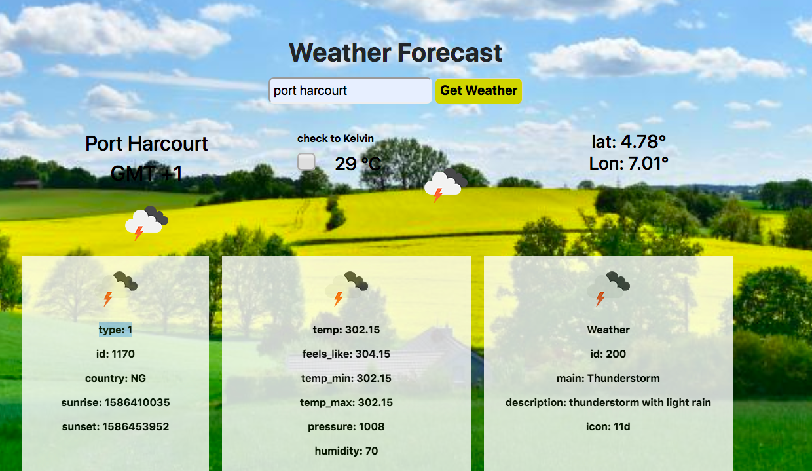

<h1 align=center> **Weather App** </h1>

[](https://github.com/RichardLitt/standard-readme)
[](https://david-dm.org/dwyl/esta)


A practical demonstration of designing a website with javascript(API)
This project is designed with a Javascript(ES6) to emulate  a weather forecast site using weather. 

The site gets a specific location from the user and toggle displaying the weather data in Fahrenheit or Celsius.

The project is part of a series of projects to be completed by students of [Microverse](https://www.microverse.org/ "The Global School for Remote Software Developers!").



## Background

- HTML
- CSS
- Javascript
- webpack

## Demo
 Check out the live demo of the project. [Click](https://5e98a2cf4254d10251a0d72d--modest-turing-850794.netlify.app/build/index.html)

## Usage
> Clone the repository to your local machine

```sh
$ git clone https://github.com/macbright/weather-app.git
```

> cd into the directory

```sh
$ cd weather-app
```

> create a js file inside the src folder named 'key.js' 
<br /> add the following lines: 

```js
export const API_KEY = 'your api key'
```

`npm install` 
<br /> to install all the dependencies that are needed

`npm start` <br/> to start the local server which will open a new tap on your default browser 


## Maintainers 

Okike Bright – [@b_okike](https://twitter.com/b_okike) – brightokike@gmail.com

[https://github.com/macbright/github-link](https://github.com/macbright)


## Contributing

1. Fork it https://github.com/macbright/weather-app.git/fork)
2. Create your feature branch (git checkout -b feature/[choose-a-name])
3. Commit your changes (git commit -am 'What this commit will fix/add')
4. Push to the branch (git push origin feature/[chosen name])
5. Create a new Pull Request

## License

The JavaScript Templates script is released under the
[MIT license](https://opensource.org/licenses/MIT).